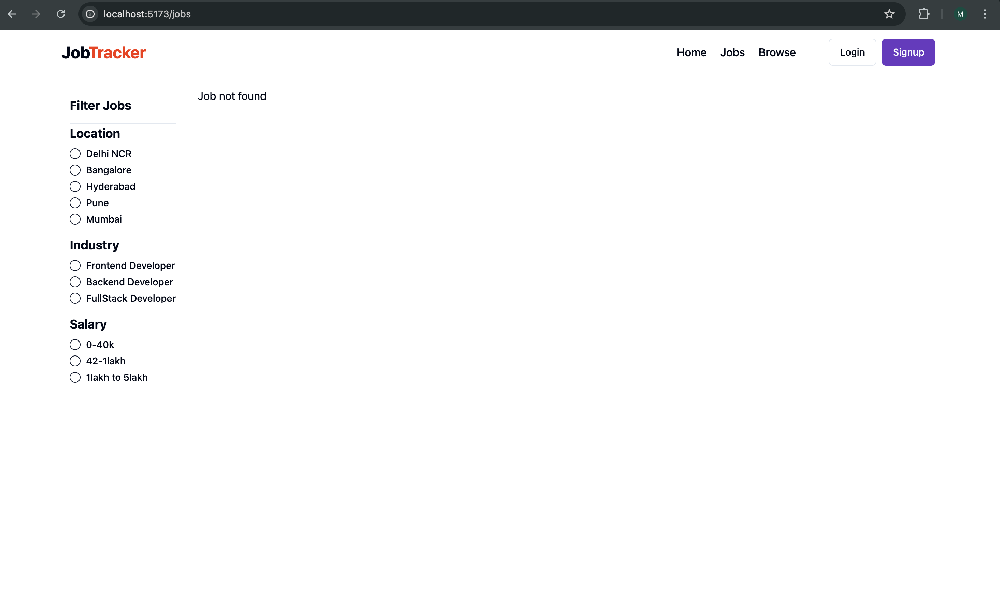
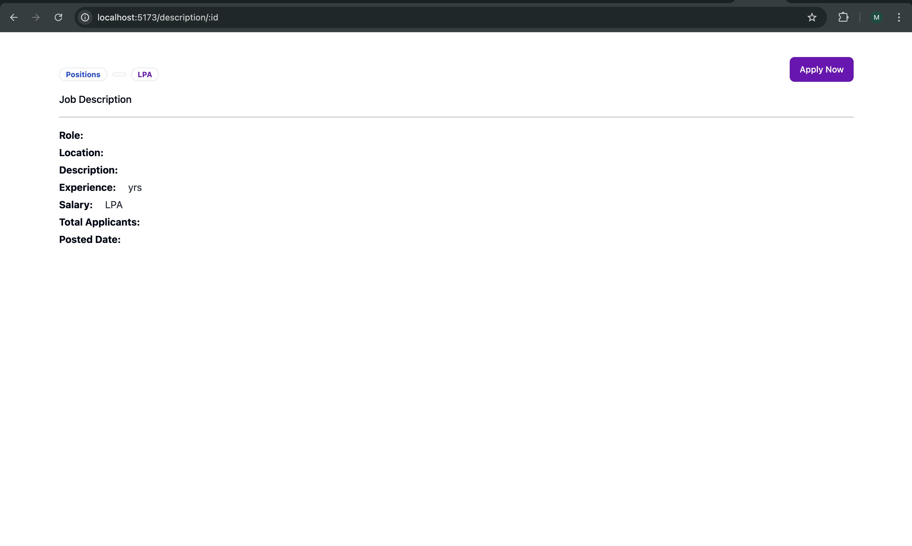
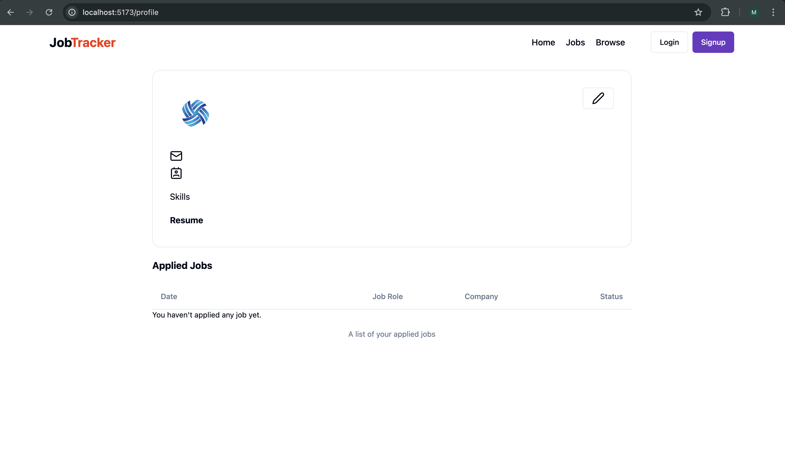

# Job Tracker - Full Stack Application

A comprehensive job tracker web application built with the MERN stack (MongoDB, Express, React, Node.js) that connects job seekers with employers.

## 📸 UI Screenshots

### Home Page


### Jobs Listings


### Job Description


### User Profile


## 🎯 Features

### For Job Seekers
- Browse and search available jobs
- Filter jobs by category
- View detailed job descriptions
- Apply to jobs
- Track applied applications
- Manage user profile
- Upload profile picture

### For Employers/Companies
- Create and manage company profile
- Post new job openings
- View and manage job postings
- Track job applications
- View applicant profiles
- Admin dashboard

### General Features
- User authentication (Login/Signup)
- Secure password handling
- File uploads with Cloudinary
- Responsive UI with Tailwind CSS
- Real-time data updates with Redux
- Protected routes for authenticated users

## 🛠 Tech Stack

### Frontend
- **React** - UI library
- **Vite** - Build tool
- **Redux** - State management
- **Tailwind CSS** - Styling
- **React Router** - Navigation
- **Axios** - HTTP client

### Backend
- **Node.js** - Runtime environment
- **Express** - Web framework
- **MongoDB** - Database
- **Mongoose** - ODM
- **Cloudinary** - Image hosting
- **JWT** - Authentication
- **Multer** - File uploads

## 📁 Project Structure

```
jobtracker-yt/
├── backend/
│   ├── index.js
│   ├── package.json
│   ├── controllers/
│   │   ├── application.controller.js
│   │   ├── company.controller.js
│   │   ├── job.controller.js
│   │   └── user.controller.js
│   ├── middlewares/
│   │   ├── isAuthenticated.js
│   │   └── mutler.js
│   ├── models/
│   │   ├── application.model.js
│   │   ├── company.model.js
│   │   ├── job.model.js
│   │   └── user.model.js
│   ├── routes/
│   │   ├── application.route.js
│   │   ├── company.route.js
│   │   ├── job.route.js
│   │   └── user.route.js
│   └── utils/
│       ├── cloudinary.js
│       ├── datauri.js
│       └── db.js
└── frontend/
    ├── components.json
    ├── index.html
    ├── jsconfig.json
    ├── package.json
    ├── postcss.config.js
    ├── README.md
    ├── tailwind.config.js
    ├── vite.config.js
    ├── public/
    └── src/
        ├── App.css
        ├── App.jsx
        ├── index.css
        ├── main.jsx
        ├── assets/
        ├── components/
        │   ├── AppliedJobTable.jsx
        │   ├── Browse.jsx
        │   ├── CategoryCarousel.jsx
        │   ├── FilterCard.jsx
        │   ├── HeroSection.jsx
        │   ├── Home.jsx
        │   ├── Job.jsx
        │   ├── JobDescription.jsx
        │   ├── Jobs.jsx
        │   ├── LatestJobCards.jsx
        │   ├── LatestJobs.jsx
        │   ├── Profile.jsx
        │   ├── UpdateProfileDialog.jsx
        │   ├── admin/
        │   │   ├── AdminJobs.jsx
        │   │   ├── AdminJobsTable.jsx
        │   │   ├── Applicants.jsx
        │   │   ├── ApplicantsTable.jsx
        │   │   ├── Companies.jsx
        │   │   ├── CompaniesTable.jsx
        │   │   ├── CompanyCreate.jsx
        │   │   ├── CompanySetup.jsx
        │   │   ├── PostJob.jsx
        │   │   └── ProtectedRoute.jsx
        │   ├── auth/
        │   │   ├── Login.jsx
        │   │   └── Signup.jsx
        │   ├── shared/
        │   │   ├── Footer.jsx
        │   │   └── Navbar.jsx
        │   └── ui/
        │       ├── avatar.jsx
        │       ├── badge.jsx
        │       ├── button.jsx
        │       ├── carousel.jsx
        │       ├── dialog.jsx
        │       ├── input.jsx
        │       ├── label.jsx
        │       ├── popover.jsx
        │       ├── radio-group.jsx
        │       ├── select.jsx
        │       ├── sonner.jsx
        │       └── table.jsx
        ├── hooks/
        │   ├── useGetAllAdminJobs.jsx
        │   ├── useGetAllCompanies.jsx
        │   ├── useGetAllJobs.jsx
        │   ├── useGetAppliedJobs.jsx
        │   └── useGetCompanyById.jsx
        ├── lib/
        │   └── utils.js
        ├── redux/
        │   ├── applicationSlice.js
        │   ├── authSlice.js
        │   ├── companySlice.js
        │   ├── jobSlice.js
        │   └── store.js
        └── utils/
            └── constant.js
```

## 🚀 Getting Started

### Prerequisites
- Node.js (v14 or higher)
- MongoDB
- npm or yarn

### Backend Setup

1. Navigate to the backend directory:
```bash
cd backend
```

2. Install dependencies:
```bash
npm install
```

3. Create a `.env` file in the backend directory with the following variables:
```
MONGO_URI=your_mongodb_connection_string
PORT=8000
JWT_SECRET=your_jwt_secret
CLOUDINARY_NAME=your_cloudinary_name
CLOUDINARY_API_KEY=your_cloudinary_api_key
CLOUDINARY_API_SECRET=your_cloudinary_api_secret
```

4. Start the backend server:
```bash
npm start
```

The backend server will run on `http://localhost:8000`

### Frontend Setup

1. Navigate to the frontend directory:
```bash
cd frontend
```

2. Install dependencies:
```bash
npm install
```

3. Create a `.env` file in the frontend directory:
```
VITE_API_END_POINT=http://localhost:8000/api
```

4. Start the development server:
```bash
npm run dev
```

The frontend will run on `http://localhost:5173`

## 📝 API Endpoints

### User Routes
- `POST /api/user/register` - Register a new user
- `POST /api/user/login` - Login user
- `POST /api/user/logout` - Logout user
- `GET /api/user/profile` - Get user profile
- `PUT /api/user/profile/update` - Update user profile

### Job Routes
- `GET /api/job/get` - Get all jobs
- `GET /api/job/get/:id` - Get job by ID
- `POST /api/job/post` - Post a new job (Admin only)
- `PUT /api/job/update/:id` - Update job (Admin only)
- `DELETE /api/job/delete/:id` - Delete job (Admin only)

### Application Routes
- `GET /api/application/get` - Get all applications
- `POST /api/application/apply` - Apply to a job
- `GET /api/application/gets/:id` - Get applications for a job

### Company Routes
- `GET /api/company/get` - Get all companies
- `GET /api/company/get/:id` - Get company by ID
- `POST /api/company/register` - Register a company
- `PUT /api/company/update/:id` - Update company

## 📧 Environment Variables

### Backend (.env)
```
MONGO_URI=MongoDB connection string
PORT=Server port (default: 8000)
JWT_SECRET=Secret key for JWT tokens
CLOUDINARY_NAME=Cloudinary account name
CLOUDINARY_API_KEY=Cloudinary API key
CLOUDINARY_API_SECRET=Cloudinary API secret
```

### Frontend (.env)
```
VITE_API_END_POINT=Backend API endpoint URL
```

## 🔐 Authentication

The application uses JWT (JSON Web Tokens) for authentication. User credentials are securely handled with:
- Password hashing
- Secure token generation
- Token validation middleware

## 📦 Dependencies

### Key Backend Dependencies
- express
- mongoose
- bcryptjs
- jsonwebtoken
- cloudinary
- multer
- dotenv

### Key Frontend Dependencies
- react
- react-dom
- redux
- react-redux
- axios
- tailwindcss
- vite

## 🤝 Contributing

1. Fork the repository
2. Create a feature branch (`git checkout -b feature/AmazingFeature`)
3. Commit your changes (`git commit -m 'Add some AmazingFeature'`)
4. Push to the branch (`git push origin feature/AmazingFeature`)
5. Open a Pull Request

## 📄 License

This project is licensed under the MIT License - see the LICENSE file for details.

## 👨‍💻 Author

Created as a full-stack job tracker application.

## 📞 Support

For support, email support@jobtracker.com or create an issue in the repository.

---
